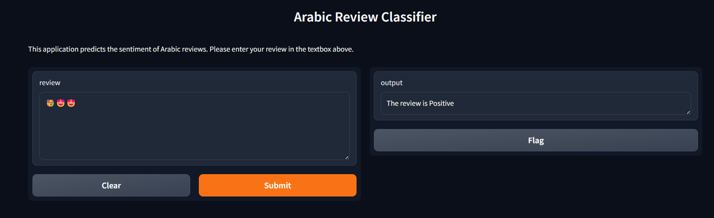

## **Sentiment Analysis Project**

### **Overview**
This project uses a Flask API to perform sentiment analysis on text data, classifying sentiments as **positive**, **negative**, or **neutral**. The application is containerized with Docker for streamlined deployment.

---

### **Features**
- **Text Sentiment Classification**: Analyze and classify text sentiment.
- **Flask API**: RESTful API for interaction with the sentiment analysis service.
- **Dockerized Application**: Ensures easy deployment and environment consistency.

---

### **Technologies Used**
- **Python**: Core language for the application.
- **Flask**: Web framework for creating the API.
- **Sentiment Analysis Libraries**: [e.g., Scikit-learn, NLTK, or Hugging Face].
- **Docker**: To containerize the application for scalability and portability.

---

### **Requirements**
- **Docker** installed on your system.

---

### **Setup and Installation**

#### **1. Clone the Repository**
```bash
git clone https://github.com/your-repo/sentiment-analysis.git
cd sentiment-analysis
```

#### **2. Build the Docker Image**
```bash
docker build -t sentiment-analysis .
```

#### **3. Run the Docker Container**
```bash
docker run -d -p 5000:5000 sentiment-analysis
```

#### **4. Test the API**
Once the container is running, you can test the Flask API:
- Open your browser and visit:
  ```
  http://localhost:5000/
  ```
- Alternatively, use `curl` to test an endpoint:
  ```bash
  curl -X POST "http://localhost:5000/analyze" -H "Content-Type: application/json" -d '{"text": "This is amazing!"}'
  ```

---

### **API Endpoints**
#### **POST /analyze**


.
  ```

### **Contributing**
1. Fork the repository.
2. Create a feature branch: `git checkout -b feature-name`.
3. Commit changes: `git commit -m 'Add feature'`.
4. Push to the branch: `git push origin feature-name`.
5. Open a pull request.

---
